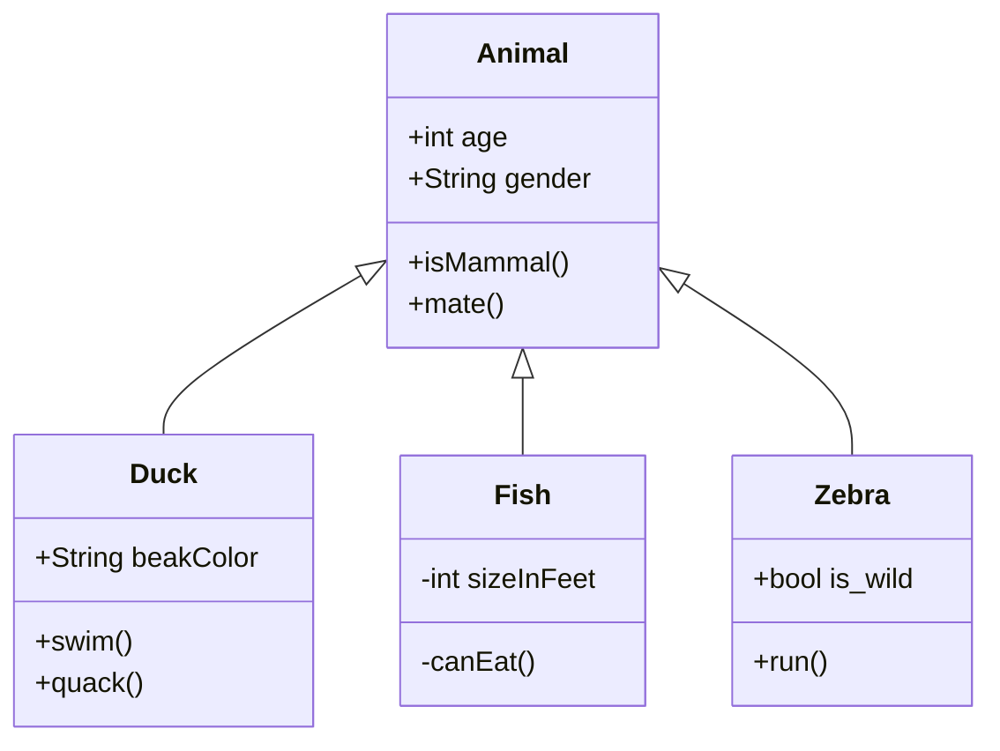

+++
categories = ['Development', 'Java']
date = '2023-08-22'
description = 'Questions for the Java Tech interview.'
slug = 'java-tech-intro'
tags = ['Java', 'Python', 'Technical']
title = 'Sample Formats'
+++
## Test of Titles (h2)

_this is italic_ **this is bold** this is regular.

### In Java (h3)

#### What's a Class? (java)

A class is a blueprint for creating objects. A class defines the properties and behaviors of objects. The class defines the following:
  instance variables,
  methods,
  constructors,
  nested and inner classes,
  and static fields and methods.

Classes are used in Java, Python, and other object-oriented programming languages. A class is a structure that defines the data and the methods to work on that data. It is a blueprint or a template for creating different objects which defines its properties and behaviors. A class is a user-defined data type that we can use in our program, and it works as an object constructor, or a blueprint for creating objects.

#### What's an Object? (python)

Objects are variables that contain data and functions that can be used to manipulate the data. The object's data can vary in type (string, integer, etc.) depending on how it’s been defined. An object is like a mini-program inside python, with its own set of rules and behaviors.

Objects contain data in the form of attributes (or instance variables) and code in the form of methods.


#### Possible Question Styles (4)

{}
But not just code in the answers. There might just be text, eh?
```java
public static String getFoo(String f) {
    return f
}
```
{}

{}
They can anser in one or two lines.
```java
double x = 3.14; // declare and init
```
or 
```java
double x; // declare
x = 3.14; // init
```
{}

{}
A very simple __Python__ `for` loop.
```py
for x in range(10)
    print(x, "ZipCode")
```
{}

{}
Always use `interface`, as `abstract` classes are hard to cook and even more difficult to eat.
```java
public interface Foo {
    Integer randomDice();
}
```
{}


Hey, cool, we can do class diagrams if we must.

